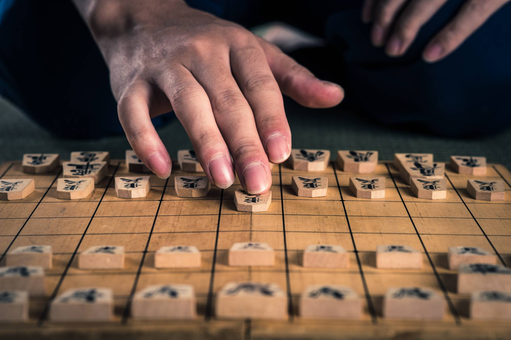
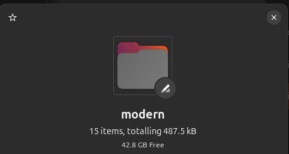
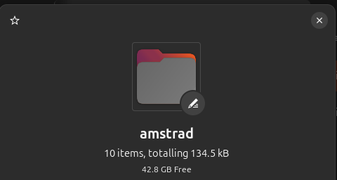

<h1 align="center">
   <b>Shogi Game</b><br>
   
</h1>

## Overview

This is a Shogi game developed using Turbo Pascal originally for the Amstrad PPC. It should also work for any other system that can run Pascal but was specifically sized and filed to run on a 3.5" 720kB DD Floppy Disk. The game includes single-player mode against five different levels of AI opponents and two-player local multiplayer mode. Additionally, it supports saving and loading games to disk.

## File Sizes From 1.0.0 release




## Table of Contents

- [Getting Started](#getting-started)
  - [Prerequisites](#prerequisites)
  - [Clone the Repository](#clone-the-repository)
  - [Copy Files to Floppy Disk](#copy-files-to-floppy-disk)
- [Usage](#usage)
- [Project Structure](#project-structure)
- [TODO List](#todo-list)
- [Contributing](#contributing)

## Getting Started

### Prerequisites

Ensure you have the following installed:

- Turbo Pascal / Free Pascal (compatible with Amstrad PPC or similar newer systems)
  - Link to which is in [Usage](#usage)

### Clone the Repository

1. Open terminal or command prompt.
2. Navigate to directory where you want to clone the repository.
3. Run the following command to clone and move to repository directory:

   ```sh
   git clone https://github.com/PhoenixCampbell/shogi_floppy.git
   cd shogi-game
   ```

### Copy Files to Floppy Disk

(This step is only necessary if using systems like the Amstrad PPC. Otherwise once the pascal compiler is installed, you are good to go.)

1. Navigate to the `src` folder in your local copy of the project:

   ```sh
   cd src
   ```

2. Copy all files from this directory to your floppy disk.

Example:

```sh
cp * /path/to/floppy/disk/
```

### Important Files to Use

- `main.exe`: file used to run the game
- `main.pas`: The entry point of the game.
- `shogi_game.pas`: Contains core logic and rules for the Shogi game.
- `ui_main.pas`: Handles user interface, including menus and gameplay options.
- `ai_opponent.pas`: Contains logic for computer generated opponent for single player game.

## Usage

Currently using `Free Pascal Compiler version 3.2.2 [2021/05/16] for x86_64` for testing and writing on modern linux systems.
Link to compiler for download: [Free Pascal Compiler](https://www.freepascal.org/download.html)

Uses `fpc` instead of `tpc` when compiling programs.

When testing on actual Amstrad system, a recommended combination of MS-DOS and Turbo Pascal 4.0 is needed to keep one floppy drive port free for the application disk. Link to this combo floppy will be available here when completed.

[Blog Post with Dev Img](https://phoenixcampbell.com/projects/pages/shogi.html)

**_STEPS 1-2 NOW OPTIONAL OR FOR DEVELOPMENT_**

1. Once you have copied the necessary files onto your floppy disk, ensure that Turbo Pascal is installed.

   ```sh
   tpc
   ```

   should return version

2. Compile the `main.pas` file using Turbo Pascal:
   - From Drive B: on Amstrad

   ```sh
   a:\tpc main.pas
   ```

   ```sh
   tpc main.pas
   ```

   - modern terminal

**Running the Game**

3. Run the compiled executable to start the game.

   for modern systems

   ```sh
   ./main
   ```

   for older systems

   ```sh
   main
   ```

## Project Structure

- `/src/`
  - `/amstrad/`: Files for older systems using tpc
  - `/modern/`: Files for modern systems using fpc
    - `main.pas`: Main entry point for the Shogi game.
    - `shogi_game.pas`: Core logic, rules, and piece movements.
    - `ui_main.pas`: User interface and gameplay options.
    - `ai_opponent.pas`: Logic for computer opponent ranging in difficulty.
    - `util.pas`: Any utilities or general reusable functions to make the game easier to code.
    - Any extra files are from compiling or are main executable. These .o, .ppu, and .exe files change with each compilation.

## Contributing

Contributions are welcome! If you find any issues or want to add new features, feel free to open a pull request. Make sure to follow the guidelines below:

- Fork the repository and clone your fork locally.
- Create a feature branch for your changes.

If you have any questions or need further assistance, please reach out!

## Todo List

There are a few things to work on in order to make this a fully usable game. I have written them here for me to remember or for anyone that wants to contribute:

### UI Improvements

- Add a picture or ASCII Shogi piece above main menu for visual appeal
  - Addition of Japanese kanji requires hardware / graphical additions to work on old hardware, which take a longer time
  - bitmap additions to allow for picture graphs for rules displaying movement
- Use arrow keys to determine coordinate location while playing instead of maunual entry
  - using previous entry from player as default during game. 5,5 as default
  - would look wierd to default back each time to center board

### Gameplay Improvements

- checkmate logic during move, after entered TO/FROM
  - to check after completing full game
- Save and load games so that the player can pickup a game from the past onto the disk
  - idea is while players are traveling, they can save their game while moving and pick it back up when they have the time

---

## License

This project is licensed under the MIT License - see the [LICENSE](LICENSE) file for details.
